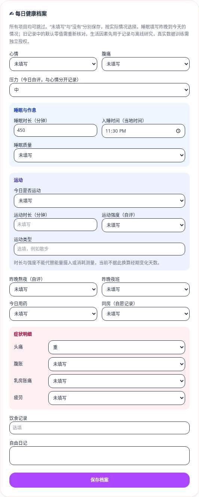
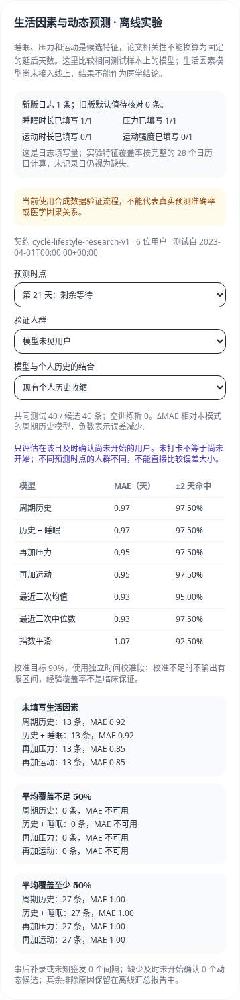

# 生活因素研究迭代

目标是研究睡眠、压力、运动是否能改善下一次开始日预测；论文中的相关性不能直接换算成“熬夜延后几天”。真实准确率提升必须由独立授权数据验证。

## 可选记录与追溯

- 未填写的数值与布尔值保存为 `null`，明确“没有”才保存 `false` 或零。部分症状对象的缺省项同样为 `null`。POST/PUT 仍整体替换当天记录；旧客户端应同步更新，避免把未填内容作为默认零发送。
- 压力是独立的今日自评 0–3，不从心情编码推断；运动增加自评强度 0–3；睡眠增加入睡时间（当地午夜起的分钟）和昨晚夜班标记。这些不是临床量表或能量摄入测量。
- `recorded_at` 是新版首次保存的 UTC 时间，`updated_at` 是最后保存时间。`daily_log_revisions` 在同一事务保存结构化生活字段快照、UTC `known_at` 与当时账户时区；日记、用药说明和同房记录不进入研究版本快照。
- 旧数据原值保留，`recording_version=0`、首次录入时刻未知。迁移生成的版本标记为 `legacy_unknown`，不倒推到原 `created_at`；前瞻生活特征不能使用它。旧表单默认零和 false 在界面回显为待核对，而不宣称是明确的否定记录。
- 导出包含研究字段版本；删除当天日志会级联删除所有对应版本，删除账号也会清理它们。数据保留清理删除日志时同样级联；备份与离线授权导出应沿用项目的私有数据政策。

## 部署

先备份，再执行 `alembic upgrade head`。本轮包含 `0006_observed_intervals` 、`0007_lifestyle_revisions` 与 `0008_cycle_research_events`。长间隔和新生活记录不支持有损回滚：存在超出旧上限的周期或新版日志时，迁移会拒绝降级；应保留备份并由部署者明确制定恢复方案。不要为降级把未知值批量改成零。

现有线上模型仍使用十列周期特征。生活字段上线不等于生活因素模型上线，不发布新权重，也不自动训练用户数据。旧完整流程评估报告因适用范围处理变化需要重新生成。

## 医学依据与边界

| 方向 | 主要研究 | 在本项目中的用途 |
| --- | --- | --- |
| 睡眠 | [Michels 等，2020，BioCycle](https://pmc.ncbi.nlm.nih.gov/articles/PMC7054152/)，259 名规律周期女性的睡眠与生殖激素观察研究 | 记录时长和作息，作为候选特征；不能推导通用的周期变化天数 |
| 压力 | [Schliep 等，2015](https://pmc.ncbi.nlm.nih.gov/articles/PMC4315337/)，日常感知压力、激素与排卵的前瞻观察 | 压力与心情分别收集，严格保存时间顺序；不把相关性当因果关系 |
| 运动 | [REFUEL 随机试验，2021](https://pure.psu.edu/en/publications/randomised-controlled-trial-of-the-effects-of-increased-energy-in/)，运动且已有月经障碍女性的能量摄入干预 | 提醒研究关注能量可用性背景；时长和强度不能替代能量评估或推广为所有用户的医疗结论 |
| 同房 | [Najmabadi 等，2022](https://pmc.ncbi.nlm.nih.gov/articles/PMC9519089/)，有/无同房周期的观察比较 | 自愿记录；存在混杂与反向关联，不纳入第一批核心模型，不添加固定延后天数 |
| 漏记与动态预测 | [Li 等，JAMIA 2022，在线发表于 2021](https://academic.oup.com/jamia/article/29/1/3/6371799) | 借鉴漏记建模和逐日更新的问题定义，需在本项目独立评估 |

以上研究的人群、测量方式和目标各不相同，不是本应用的临床验证。模型适用范围与记录质量提示不代表医学诊断。

## 周期追溯与核对

周期的开始/结束日期也保存 UTC 版本；注册补录、开始、结束、修改均在原写事务内留存版本。旧周期只在迁移时建立当前快照，不声称能恢复过去录入时刻。删除周期会删除关联版本与核对信息，并标记账户历史重置时间；研究不能利用已删除信息或将此前缺失的历史当成完整历史。

`POST /api/v1/cycles/{cycle_id}/tracking` 接收 `kind` 和 `as_of_date`：`unknown`（不确定）、`missed_tracking`（漏记）、`true_long_interval`（真实间隔）、`no_onset`（截至该日尚未开始下次经期）。仅允许操作自己的周期，日期不能超出账户今天；已出现后续开始时不能提交未开始确认。漏记/真实间隔核对需要已有后续开始记录。确认附带锚点，修改开始日后旧确认不再适用于新锚点；界面显示最新确认。

没有填写确认并不等于没有开始经期。确认不会补造缺失日期或直接改变线上预测，动态预测先留在离线实验。导出与删除包含周期版本与核对记录；存在这些新版记录时迁移拒绝有损降级。

维护脚本沿用账户写锁和原事务：历史修复在实际运行时保存 `repair_snapshot`，不会伪装成当年的用户录入；保留期限清理会标记受影响账户的历史重置、重算剩余周期长度，并级联删除相关研究事件。只读预览不写这些记录。

## 离线对照实验

只使用合成数据验证流程：

```bash
cd wishindiary-api
python scripts/lifestyle_backtest.py --synthetic-only \
  --calibration-cutoff 2022-10-01T00:00:00Z \
  --test-cutoff 2023-04-01T00:00:00Z \
  --data-as-of 2024-01-01T00:00:00Z \
  --output-dir ../../wishindiary-private-research
```

把仅含汇总的 `lifestyle_evaluation_report.json` 放到部署的 `MODEL_PATH` 同目录，管理端会读取。报告不能含个人事件，页面只返回允许的指标；未知契约、不同方法样本数不一致、训练标签越过边界或测试用户进入全局训练的报告会被拒绝。代码摘要不匹配时页面提示重新生成。

真实数据仅接受有 UTC 事件时间的授权数据库或授权事件 JSON；普通开始日期 CSV 不能恢复过去何时知道某条记录，因此不作为这个实验的输入。数据库运行必须由部署者先确认独立研究授权：

```bash
python scripts/lifestyle_backtest.py --database --acknowledge-authorized-data \
  --calibration-cutoff <预先固定的UTC签发截点> \
  --test-cutoff <独立未来测试截点> \
  --data-as-of <实际已观察事件的截点> \
  --output-dir <仓库外私有目录>
```

`--data-json` 的结构是 `cycle_revisions`、`daily_log_revisions`、`cycle_tracking_events` 三个事件数组和按用户 ID 映射的 `resets`。用户导出接口提供这些事件；单用户导出只能验证个人时间流程，不能支持分用户泛化结论。文件、备份与授权导出不得提交 Git。

### 固定比较口径

- 契约 `cycle-lifestyle-research-v1` 与线上 `cycle-rf-v2` 分开。四组输入是历史、历史+睡眠、再加压力、再加运动；每组比较直接 RF 输出和现有 K=4 个人历史收缩。另对比最近三次均值、中位数和指数平滑。
- 训练、候选推理和回测共用特征函数，历史窗口最多 50 条且至少 3 条符合当前资格的已知长度。睡眠时长均值/波动、圆周编码的睡眠中点/规律度、夜班/熬夜率、压力水平/变化、运动时长/自评负荷/变化均只使用预测前已知的修订版本。
- 生活窗口是之前 28 个日历日，排除发起当天。未填天仍进入覆盖率分母；缺少观测的均值或变化保持缺失，不当成零。中位数填补器只在训练段拟合，并保留缺失指示。自评运动负荷不是能量消耗或临床量表。
- 历史日期按首次及时录入发起预测；事后补录不还原为当年的预测。训练与校准数据分别从各自截点的周期和核对版本重建，后来修正日期或标记漏记不能反向修改早期拟合数据。删除造成的信息缺口不恢复；修改过的目标/后继开始日保守排除，并报告原因。
- 全局模型在校准前冻结，校准标签必须在测试截点前可用。既有用户和模型未见用户分开；未见用户不进入该折全局训练或校准。所有特征组、收缩模式与基线共享该人群/时点的测试样本，报告共同样本数、候选数、空折和排除原因。
- 指标包含 MAE、±2 天命中率、相对基础历史模型的 ΔMAE，以及独立时间校准的区间覆盖/宽度/不足样本数。按生活因素平均覆盖率为零、不足 50%、至少 50% 分组。收缩在 50 条历史时给模型约 7.4% 权重；这可能衰减新增因素信号，是否调整需由固定独立数据验证。
- 第 7/14/21 天实验预测“还要等待多少天”，需要该日及时录入的明确未开始确认。未打卡不算确认。不同阶段是不同的条件人群，各阶段单独冻结训练与校准，不用阶段误差大小直接宣称动态模型优于开始日模型。

本实验重训的是候选研究算法，不是对当前部署权重的复测，也不将研究区间或动态日期自动上线。合成数据特意构造生活因素模式，只证明流程能工作；真实数据授权、足够的及时记录、独立样本及临床适用人群审查仍是后续研究条件。

## 本轮验证（2026-10-03）

后端全量 331 项测试通过，覆盖率 89.13%；前端 69 项单元测试、lint、类型、格式及生产构建通过。Ruff、项目 Python 依赖审计和 npm 高危依赖审计通过。

隔离 MySQL、真实 API 与 Chromium 的 9 项端到端测试通过，包括未知/明确没有的保存与读取、症状提示、单日预测显示和刷新会话。另以纯合成账户和报告验证管理端对照切换、手机 390px 无横向溢出、普通用户 403、超出范围不显示预测日期，浏览器无未捕获异常。示例离线事件有 456 个符合条件的阶段样本，只用于流程验证。




部署需同步后端、前端并执行上述迁移；先用合成数据确认管理端报告，再独立授权并收集真实及时记录。真实 SMTP 送达及真实用户效果按部署后的安排验证。
