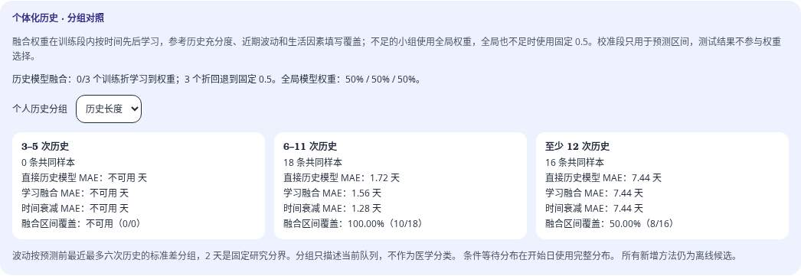
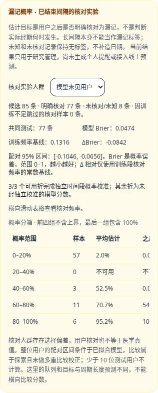

# 个人历史、条件等待与漏记核对研究

本轮新增离线候选和管理端汇总，不切换线上日期算法、不发布模型权重、不生成个人漏记提醒。研究读取仍经过独立成年授权、事件修订、冻结快照和撤回/删除失效机制。合成演示只验证实现；真实效果需要后续独立授权数据。

## 个人历史与学习融合

19 个方法共用每个预测时点、每种验证协议的测试队列。保留四组生活因素 RF 的直接输出与原有 `k=4` 收缩，以及最近三次均值、中位数、指数平滑；新增以下方法：

| 方法 | 预测前可用的信息 | 固定规则 |
| --- | --- | --- |
| `personal_mean` | 最多 50 次合格完整历史 | 全历史均值 |
| `recent6` | 最近最多六次合格历史 | 近期均值 |
| `decay3` | 最多 50 次合格历史 | 按周期顺序指数衰减，半衰期三次 |
| 四组 `*_adaptive` | RF、时间衰减历史及填写覆盖 | 训练段学习模型权重，与个人历史融合 |
| `conditional_history` | 训练队列和个人历史的离散分布 | 有及时未开始确认时，条件化剩余等待 |

融合权重的学习在外层训练段内部进行。按签发时间的约 60% 位置取内层边界，同一时刻不拆开；内层 RF 只使用边界前已经可知的标签。后 40% 左右的训练样本选择权重，外层校准段和测试段均不参与选择。随后用整个外层训练段拟合 RF，冻结选出的融合规则，预测独立校准段和测试段。

固定权重网格为 `0/0.25/0.5/0.75/1`，比较最终取整后预测的 MAE；平局优先较小的 RF 权重。全局至少需要 20 个验证样本和三位用户。分层参考历史长度（3–5 / 6–11 / 至少 12）、最近最多六次的标准差（≤2 / >2 天）和生活因素覆盖（零 / 不足一半 / 至少一半）。每层也需至少 20 个样本和三位用户，不足则用全局权重；全局不足时明确回退到固定 0.5。这些数量是预先固定的运行门槛，不是统计功效或医学阈值。覆盖率只是填写质量的代理，不能证明记录准确。

管理端分别展示历史长度、波动和原有填写覆盖分组的样本、MAE、区间覆盖与校准分母。融合权重是否学到、多少折回退均明确显示；分组结果只作探索性描述。

原有固定主对照仍为开始日、模型未见用户的“生活因素直接模型相对直接历史模型”。本轮个人融合、条件等待和核对概率均为探索比较；不在看到测试结果后更换主对照。若后续以个体化增益为主要研究问题，需另行预先登记新数据上的主要比较。

## 条件等待

离散研究支持为 15–45 天，与当前历史模型边界一致，不是临床正常范围。训练标签构造人口分布，每位训练用户的总质量相同，并在每个支持日加入 0.5 平滑质量。个人分布使用签发前完整历史，以 `n/(n+4)` 与人口分布结合。

开始日使用完整分布。第 7/14/21 天仅对已在当天及时明确核对“尚未开始”的队列，保留 `T > 当天` 的概率质量，再计算剩余等待均值、取整并至少为一天。不从未打卡推断尚未开始；不同阶段队列不同，不直接用误差下降声称动态方法更好。各方法区间仍使用独立时间校准段，90% 是目标而非覆盖保证。

## 漏记概率的第一步

`closed-gap-tracking-v1` 是一个可审查的监督基线，估计“这段已结束的记录间隔之后是否被用户明确核对为漏记”。它在后续开始日被及时记录后，使用当时可知的间隔、先前历史和填写覆盖；之后出现的核对才是评价标签。

- `missed_tracking` 为明确正标签；`true_long_interval` 为明确确认间隔真实的负标签。
- 无核对或最新核对为 `unknown`，保持无标签。长间隔不自动变成正标签；普通未打卡不自动变成负标签。
- 后来改成未知，会从后续评价中移除该标签；在训练/校准截点分别重建当时可知的核对，未来更正不重写过去的拟合数据。
- 当前已知核对不得成为新的未来评价标签；编辑过的目标开始、未知/事后补录的后续签发、加入前目标、删除重置前目标和未成年背景会排除。
- 原始长间隔保留，不除以二、不推断漏了几次、不补造经期日期。历史参考统计只选已知且未明确核对漏记的 15–45 天间隔，缺少历史时保留缺失指标。

训练使用只在训练段拟合的中位数填补、缺失指标和标准化，再拟合逻辑回归（`C=1`、`liblinear`、种子 42）。至少 20 条训练标签、三位用户且正负各五条，否则不拟合。独立时间校准段也达到同样门槛时，用训练模型的分数进行 sigmoid 概率校准；不足时明确显示未经独立概率校准。模型未见用户协议同时从训练和概率校准中排除该用户。

在完全相同的已核对测试间隔上，比较模型与训练段核对频率的 Beta(1,1) 平滑常数基线。报告 Brier 概率误差、ΔBrier、整位用户重采样的配对 95% 区间和五个固定概率分箱。少于十位测试用户不计算区间；区间条件于已拟合模型，探索比较未校正多重性。管理端只读取聚合数据，不返回身份、个人概率、事件行或模型系数。

这是**用户核对目标**，不是未观测生理事实。已核对队列存在选择偏差，不能把该队列的效果推广到所有未核对用户。概率实验和周期预测的人群、目标不同，分数不能横向比较。若所有周期历史都超出日期模型范围，只要漏记概率队列满足拟合条件，仍可运行核对实验；日期部分显示零个可用样本。

## 运行与复核

使用 [RESEARCH_GOVERNANCE.md](RESEARCH_GOVERNANCE.md) 的登记、冻结、运行、重放流程。新登记同时冻结个人融合、条件等待、核对概率的参数，以及含明确漏记、真实长间隔、未核对场景的合成生成规则。整个 `evaluation`（包括核对概率）参与重放摘要核对。

```bash
cd wishindiary-api
python scripts/research_experiments.py register \
  --calibration-cutoff 2022-10-01T00:00:00Z \
  --test-cutoff 2023-04-01T00:00:00Z \
  --data-as-of 2024-01-01T00:00:00Z
# 将登记输出的 UUID 用作 RUN_ID，命令分别执行。
python scripts/research_experiments.py freeze RUN_ID --synthetic-only
python scripts/research_experiments.py run RUN_ID --publish-report
python scripts/research_experiments.py replay RUN_ID
```

历史测试时段登记为回顾性探索。要做前瞻验证，必须在新测试段开始前登记协议，并在观察截止后冻结数据。授权数据库冻结仍需当前有效的独立研究同意和 CLI 授权确认；旧个人导出不能冒充研究快照。实验注册和训练都通过部署侧 CLI 完成，管理端不提供训练或任意路径入口。

算法摘要变化后，旧登记拒绝按新代码运行；恢复原环境重放旧实验，或登记新的协议。扩展后的管理端报告需按新代码重新生成。没有新增数据库迁移；已有部署仍须完成上一轮的 `0009`/`0010` 迁移。SMTP 和真实数据效果继续留待部署后验证。

## 论文依据与下一步

Li 等的 [JAMIA 2022 论文](https://academic.oup.com/jamia/article/29/1/3/6371799)（[作者稿](https://arxiv.org/abs/2102.12439)）说明分层生成模型可以把个人历史、漏记和随时间更新的预测放在同一框架中。2025 年 [SkipTrack 作者预印本](https://arxiv.org/abs/2508.05845) 强调漏记推断的不确定性应传递到后续分析，不能预先把推测的漏记固定成事实。

本实现采用这些问题意识，**没有复现这两篇论文的分层贝叶斯模型**。当前闭合间隔监督基线也不估计正在等待的用户已经漏记的后验概率。后续先在新的独立授权及时记录中检验融合增益和核对概率可靠性，评估核对选择偏差，再考虑将漏记个数、周期均值和波动共同建模。可穿戴体温/腕温接入需要先约定设备、时区、单位、缺测与授权；其增量价值单独检验，不能先承诺更准。

## 本轮验证（2026-10-04）

| 验证 | 结果 |
| --- | --- |
| 后端完整 MySQL 回归 | 364 项通过；覆盖率 89.66%；Ruff 通过 |
| 前端 | 80 项通过；类型、lint、格式、生产构建通过；高危依赖审计无漏洞 |
| 隔离 MySQL / API / Chromium | 10 项端到端通过，SMTP 关闭 |
| 新研究流程 | 12 位合成用户、19 个方法、436 个阶段样本；完整评估重放摘要一致 |
| 漏记核对演示 | 模型未见用户协议 77 条已核对测试间隔、8 条未核对/未知；三折独立概率校准 |
| 额外浏览器检查 | 新模式、历史/波动和核对人群切换、390px 手机无页面横向溢出、普通用户 403、账号隔离、无未捕获异常 |

回归包含未来标签隔离、未知恢复、已经知道的核对结果不因后来更正变成未来目标、不同波动层学习不同权重、稀疏回退，以及没有日期预测样本时仍可独立研究核对概率。上述样本和截图全部为合成演示，不作为真实效果证据。

合成演示的个人历史分组（小样本折如实显示固定回退）：



合成演示的手机核对概率汇总（表格可横向滑动）：


