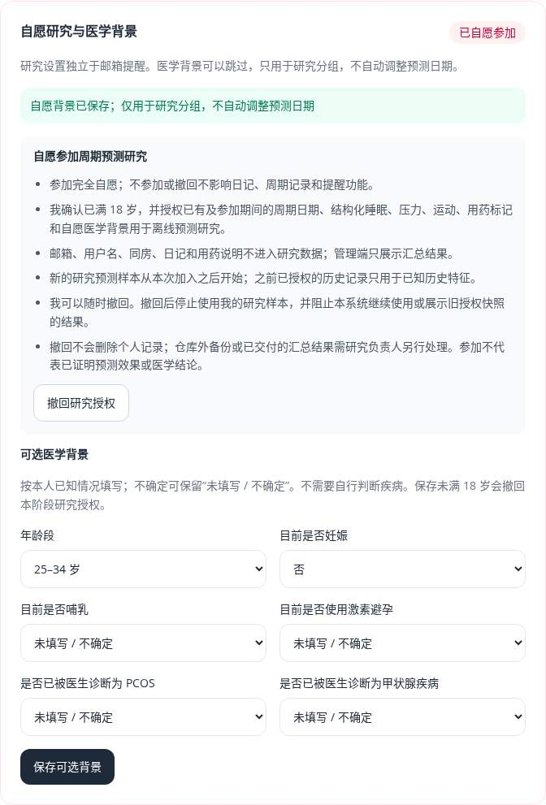
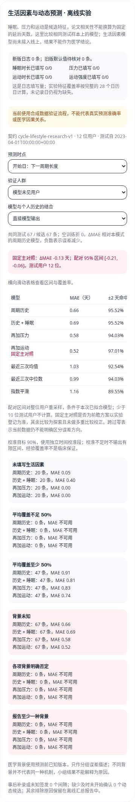

# 研究授权与实验治理

本轮从独立研究授权、医学背景分组和可复现评估开始。参加研究不影响个人记录、预测和邮箱提醒；管理员只能查看汇总。

## 自愿参加与医学背景

背景字段参考 [NICHD 月经不规律的原因说明](https://www.nichd.nih.gov/health/topics/menstruation/conditioninfo/causes)，作为可能改变适用人群的上下文；该资料没有提供各因素可直接换算的统一预测天数。哺乳背景与妊娠、激素避孕、已诊断疾病分别保存，后续有足够数据时再作细分研究。本项目不使用背景自行诊断。

- 新账号和旧账号默认不参加。`GET /api/v1/research/participation` 返回当前说明版本、本人状态和可选背景。
- `PUT /api/v1/research/participation` 加入时提交 `participate=true`、当前 `policy_version`、`adult_confirmed=true`。本阶段只接受确认已满 18 岁的参与者。
- 撤回提交 `participate=false`。撤回保留个人记录；重新加入形成新的授权批次，不恢复旧批次的研究预测样本。
- `PUT /api/v1/research/background` 保存完整的可选背景快照：年龄段、妊娠、哺乳、激素避孕，以及本人是否已被诊断 PCOS 或甲状腺疾病。未填写为 `null`，明确否定才为 `false`。不推断诊断，不要求精确出生日期。
- 背景按 UTC 保存修订时间，只用于当时已知的研究分组，不自动给在线预测增加或减少天数。研究资料不包含邮箱、用户名、同房、日记和用药说明。
- 加入时明确授权已有结构化历史作为特征，新研究预测样本从本次加入后开始。研究分析仍需处理补录、缺失和记录核对，授权不等于数据质量或医学有效性。

授权和背景修订包含在本人数据导出中。账号删除会级联删除；研究撤回不删除个人记录。系统外备份和已经交付的汇总结果由研究负责人另行处理。

## 研究样本与数据质量

离线数据库输入仅包含当前授权用户的结构化事件、当前加入时间和可选背景版本。签名快照绑定内容摘要、说明版本及当前授权批次。撤回、重新加入和队列变化会使旧快照与报告停止使用；个人数据导出不作为研究授权。研究脚本在训练完成后再核对授权，管理端每次读取也核对。

背景按预测签发前已知的版本分组，后来填写的背景不回写过去样本。明确填写未满 18 岁时，在保存背景的同一事务撤回授权。

管理端的授权队列统计独立于全站运营计数。首次录入当天或次日称为及时记录，之后称为补录；旧版首次录入时刻未知单独计数。最近 28 个已结束日历日的分母从本次加入日开始，不包含今天；无记录的天也计入。字段覆盖保留未知与明确零的区别。在线汇总有数量上限，超过上限要求有界离线统计。

## 配对误差与不确定性

相对历史模型的 ΔMAE 使用同一批预测事件和真实结果。95% 百分位区间以用户为重采样单位，每次保留该用户所有周期，默认种子 42、重复 1000 次；避免把同一人的多次记录当成独立受试者。目标仍是周期加权的平均绝对误差差值，区间条件于本次已拟合模型，不包含重新训练的全部不确定性。

少于 10 位测试用户时不计算该区间，明确返回不可用；10 是程序门槛，不是足够样本或临床有效性的证明。固定主要比较为开始日、模型未见用户、全部生活因素直接输出相对基础历史模型。其他时点、模式和组别比较属于探索，没有多重比较校正；历史数据上注册的主要比较仍标记为回顾性探索。负差值表示当前测试误差较少，不能据此证明因果关系或上线效果。

## 固定实验、冻结与重放

旧 `train.py` 的默认数据库输入和 `backtest.py --database` 已停用，因为它们只有当前日期行，不能重建授权和录入时间边界。旧数据库来源的汇总报告也停止展示。原合成演示和外部独立授权 CSV 实验继续可用；应用用户数据统一通过当前事件快照研究流程处理。此轮不训练或发布真实用户权重。

管理端只读显示最近 20 个实验登记。实验运行由部署者通过 CLI 完成，没有网页训练接口或任意文件路径接口。登记时固定时间截点、主要比较、随机种子、RF 参数、重采样次数、代码摘要和依赖版本。方案、私有事件快照、汇总报告与清单保存在 `MODEL_PATH` 同目录的 `research_experiments/<实验ID>/`，该目录被 Git 忽略；快照权限为 0600。方案签名和文件摘要用于检测修改，不替代外部研究注册或伦理审核。

合成流程示例（历史时间段会标记为回顾性探索）：

```bash
cd wishindiary-api
python scripts/research_experiments.py register \
  --calibration-cutoff 2022-10-01T00:00:00Z \
  --test-cutoff 2023-04-01T00:00:00Z \
  --data-as-of 2024-01-01T00:00:00Z
# 将下方值替换为注册命令输出的 32 位 ID
WISH_EXPERIMENT_ID="注册命令输出的ID"
python scripts/research_experiments.py freeze "$WISH_EXPERIMENT_ID" --synthetic-only
python scripts/research_experiments.py run "$WISH_EXPERIMENT_ID" --publish-report
python scripts/research_experiments.py replay "$WISH_EXPERIMENT_ID"
python scripts/research_experiments.py list
```

真实研究先登记独立未来测试截点，等待实际观察截点到达，再使用 `freeze <实验ID> --database --acknowledge-authorized-data`。冻结只包含当前自愿参加的用户，个人导出不能替代此快照。`run` 和 `replay` 使用相同快照、代码及依赖；重放核对完整评估摘要，不覆盖旧实验。方案或环境变化需新建实验。`--publish-report` 只更新管理端读取的汇总报告，不发布权重或更改在线预测。

本地在测试截点之前登记仅表示存在前瞻方案，不证明数据未被看过，也不替代独立验证。合成实验默认 12 位用户以演示配对区间，合成信号不代表真实效果。真实数据授权变化会阻止旧报告展示和重放。

## 部署

执行 `alembic upgrade head`，新增 `0009_research_participation` 与 `0010_research_deletion_epoch`。迁移不自动替用户授权；存在授权、背景或删除标记时拒绝有损降级。新增接口使用现有会话与 CSRF 保护。

删除日志、周期及保留期限清理在原事务中更新研究删除标记，使包含已删记录的旧快照和报告失效。删除不改变本次加入时间或个人研究状态。私有历史快照文件不会自动消失，研究负责人应按备份策略清理；系统会阻止继续重放或展示其结果。

## 本轮验证（2026-10-04）

后端全量 349 项测试通过，覆盖率 89.50%；包括未授权默认排除、授权版本与成年确认、撤回/重新加入、删除与保留期限失效、背景追溯、私有快照篡改、冻结与重放、配对区间及旧入口禁用。迁移升级、降级和往返通过。

前端全量 75 项测试、Ruff、lint、类型、格式、生产构建和 npm 高危依赖审计通过。隔离 MySQL、真实 API 与 Chromium 的 10 项端到端测试通过。另验证邮箱未配置时仍可参加研究、背景保存、撤回、普通用户 403、账号隔离、390px 手机无页面横向溢出，浏览器无未捕获异常。

12 位合成用户的固定实验包含 912 个符合条件的阶段样本，生成汇总并重放核对全部评估摘要，配对区间使用完整用户重采样。该实验是历史时间段的流程演示，不能证明真实准确率改善。真实 SMTP 和真实效果继续按部署后的安排验证。



