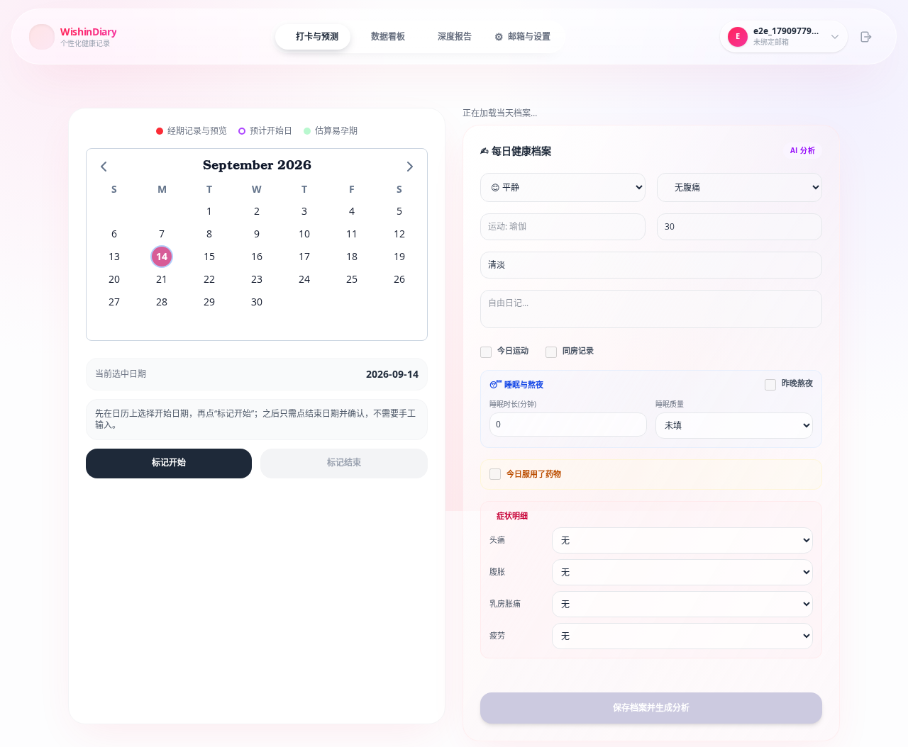
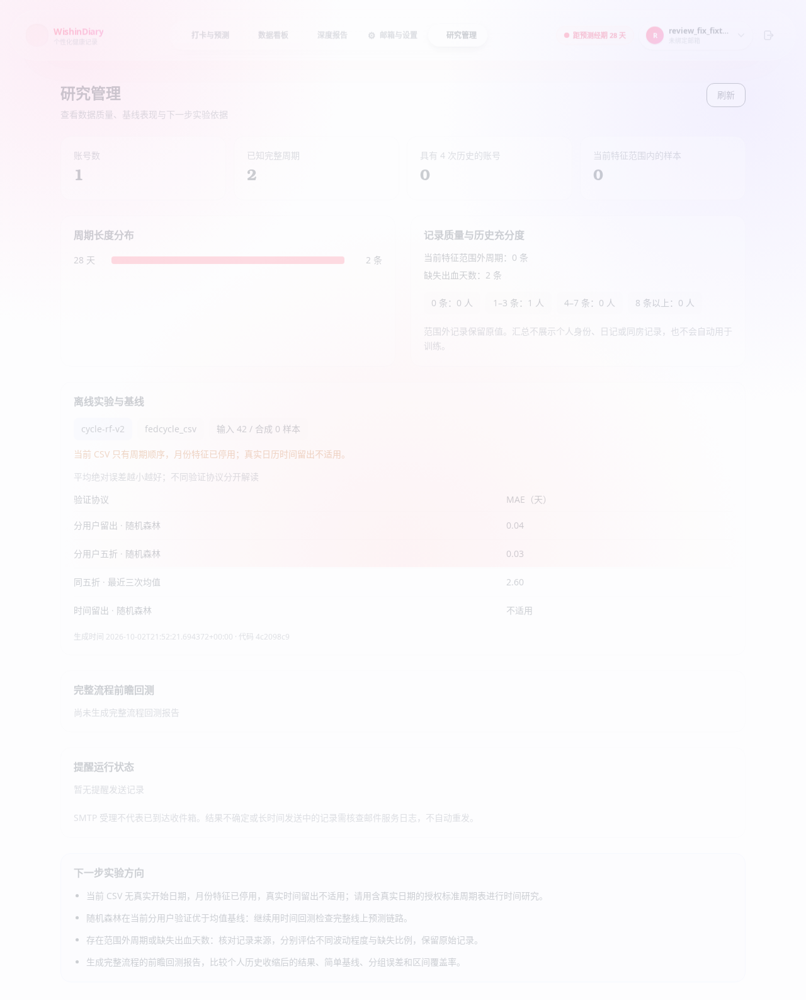

# 代码审查问题修复与验证

本轮以 `codex/temporal-stability` 为基础，修复七项已复现的问题。改动按周期记录、日历保存、登录续期、异常提示、CSV 日期语义和日志过滤分别提交。

| 问题 | 修复后的行为 | 回归验证 |
| --- | --- | --- |
| 经期已结束后记录下一次开始，上一周期长度仍为空 | 新开始记录在同一事务内重算相邻周期长度 | 正常记录后立即得到 28 天长度，基础预测可用 |
| 漏记结束日或注册补录阻断后续结束操作 | 未知结束日保持为空；默认结束只作用于最新周期，历史记录可按 ID 补齐 | 漏记、注册补录、历史修正及真正重叠的拒绝 |
| 切换日期时保存上一日期内容 | 表单绑定已加载日期；加载、失败和保存期间禁用保存，加载失败可重试 | 加载未完成、watch 尚未执行、失败重试、旧响应迟到；浏览器核对两天实际存储内容 |
| 刷新令牌轮换可被并发重复消费 | 读取加行锁，撤销与签发在同一事务中提交，提交后才设置 Cookie | 两个独立请求只有一个成功；插入后故障整体回滚 |
| 异常长间隔被模型过滤后不再提示 | ML 和基础统计都检查原始最近间隔，独立于模型资格过滤 | 56 天及 12 天异常在真实 API 中可见，正常记录无提示 |
| CSV 占位日期被当作真实月份和时间边界 | 标记 `synthetic_cycle_order`；月份列固定为零；真实时间留出不适用 | 实际训练产物的月份重要性为零，十列契约保留，报告和管理端明确标注 |
| JSON 日志的字段白名单没有落实 | 格式化输出过滤 extra 与字典消息；审计 details 只保留合法周期 ID | 虚构邮箱、密码、令牌、日记和健康日期均未进入对应日志输出 |

## 验证结果

- 后端全量：307 项测试通过，覆盖率 88.30%，超过 80% 门槛。
- 前端全量：63 项单元测试通过；lint、类型检查、格式检查和构建通过。
- 隔离 MySQL、真实 API 与 Chromium：8 项端到端测试通过。
- 受控延迟的日历保存用例另外复核；管理端桌面与 390px 手机验证，无页面横向溢出或页面异常。
- Ruff、npm audit、pip-audit 通过；没有依赖升级。
- 所有测试、CSV 训练和截图只使用合成数据；未发送真实邮件，未改动已部署数据库或发布新模型权重。

## 部署后操作

无需新增数据库结构迁移。旧数据可能已保留此前生成的矛盾结束日或缺失周期长度，应先检查，再执行数据修复。

在 API 目录运行：

```bash
python scripts/repair_cycle_history.py
```

默认只报告数量，不改记录、不输出健康日期。只有确认结果并备份数据库后，才执行：

```bash
python scripts/repair_cycle_history.py --apply --backup ../../wishindiary-private-backups/cycle-recovery.json
```

脚本先保存权限为 `0600` 的私有恢复副本，再提交数据库事务；恢复副本必须在仓库外，不覆盖已有文件。仅清理符合旧自动闭合矛盾模式的结束日，不推测真实结束日期。超过数据库支持的 120 天间隔保留供人工核对。

旧 CSV 入口训练的模型需要重新训练，并更新配套评估报告与 `MODEL_SHA256`。算法源文件摘要已变化，完整流程回测报告应重新生成，管理端会提示代码与旧报告不匹配。真实 SMTP 送达与真实用户效果仍按部署后的验证安排进行。

## 界面验证

日历加载中的表单和保存操作均禁用；切换日期时清除上一日期的成功提示和分析内容。



下图以纯合成数据构造 CSV 格式输入，验证来源标记和“不适用”状态。图中的误差不代表真实用户预测效果；“输入”计数指外部 CSV 的输入样本，“合成”计数指训练脚本追加的兜底样本。




