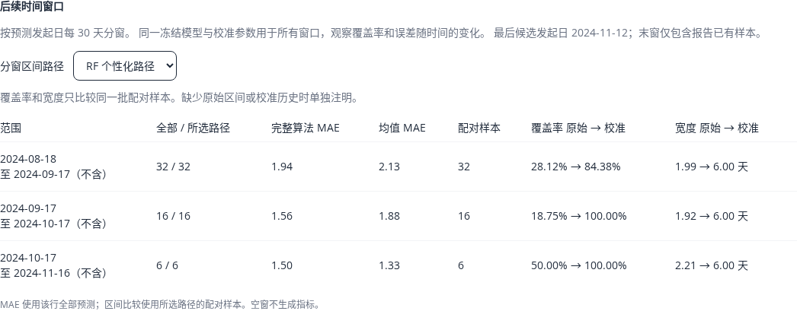
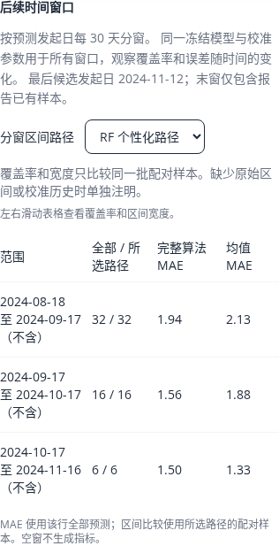

# 冻结模型的后续时间分窗

本入口用于离线研究：将未来测试样本按预测发起日分成连续、不重叠的固定窗口，观察误差、覆盖率和区间宽度。所有窗口使用同一冻结模型和校准器；个人历史仍只随当时已完成的周期更新。它不替换部署权重、用户预测日期或邮件提醒。

## 运行与边界

```bash
cd wishindiary-api
python scripts/backtest.py --synthetic-only --calibrate-intervals \
  --calibration-cutoff 2024-06-26 --test-cutoff 2024-08-18 \
  --time-window-days 30 --output-dir /path/to/experiment
```

`--time-window-days` 必须与 `--calibrate-intervals` 一起使用，允许 1–365 天，最多 60 个窗口。窗口从固定测试截点开始，采用 `[开始日, 结束日)`：结束日当天的预测属于下一个窗口。空窗保留，末窗只包含当前报告已有样本；窗口边界不能解释为该段已被完整观察。

日期、窗口长度、覆盖目标和模型参数应在查看测试结果前固定。既有用户与模型未见用户分别评估，且采用相同窗口边界；未见用户从该折全局训练和校准中留出。全部窗口直接汇总同一批已生成的预测，不使用窗口结果重新拟合或校准。

统计按预测发起日归窗，真实目标可能在窗口结束以后才完成。离线回放继续假设既往记录当时已可用；真实用户迟填和改写记录，需要首次签发快照的后续观测。三段协议与校准计算见 [INTERVAL_CALIBRATION.md](INTERVAL_CALIBRATION.md)。

## 报告与管理端

启用分窗时写入 schema 3；不启用时仍生成 schema 1 / 2。管理端兼容三种格式，旧格式不生成虚构的时间窗。算法摘要改变后需重新生成对应报告。

- 每窗展示样本量、完整算法与均值的 MAE，以及 RF / 基础统计路径的区间对比。
- 原始与校准区间仅使用相同配对样本比较覆盖率和平均宽度；额外说明校准不足及全部可校准样本的结果。MAE 的分母是该窗全部预测，区间分母是所选路径的配对样本。
- 有效历史条数、预测时已知的历史波动、出血天数缺失比例也增加配对区间指标，分组不使用被预测周期的结果。
- 空窗和空组不生成误差、覆盖率或宽度；实测零误差、零宽度正常保留。窗口不足不通过合并路径或读取测试标签来补足校准。
- 报告读取校验日期连续性、窗口数量、路径样本数、配对样本数和各分组分区总量；非法报告返回明确不可用状态。接口只返回白名单汇总，不返回用户编号、残差或记录。
- 研究建议指出存在低于目标的可评估窗口，帮助定位进一步验证的方向。小样本与时间相关性仍影响解释，分窗覆盖率不构成个体保证。

管理端仍只读取 `MODEL_PATH` 同目录的固定报告；实验目录的文件需由部署者按既有报告流程放置，页面不提供任意路径或在线训练入口。授权 CSV / 数据库条件见 [RESEARCH_BACKTEST.md](RESEARCH_BACKTEST.md)。

下图来自隔离本地 API 的合成报告。桌面显示完整指标，手机通过表格内部横向滑动查看覆盖率和宽度；页面本身不产生横向溢出。





## 合成演示诊断

2026-10-01 使用既有演示的 30 个模拟用户、300 条周期，固定校准开始 2024-06-26、测试开始 2024-08-18、30 天窗口。每种协议的 54 条测试样本分为 32 / 16 / 6 条。以下均为 RF 路径的相同配对样本：

| 预测发起窗口（结束日不含） | 样本 | 既有用户 MAE（天） | 既有用户原始 / 校准覆盖 | 未见用户 MAE（天） | 未见用户原始 / 校准覆盖 |
| --- | ---: | ---: | ---: | ---: | ---: |
| 2024-08-18 → 2024-09-17 | 32 | 1.9375 | 28.12% / 84.38% | 1.9062 | 28.12% / 90.62% |
| 2024-09-17 → 2024-10-17 | 16 | 1.5625 | 18.75% / 100.00% | 1.6250 | 18.75% / 100.00% |
| 2024-10-17 → 2024-11-16 | 6 | 1.5000 | 50.00% / 100.00% | 1.3333 | 33.33% / 100.00% |

既有用户的校准区间各窗均宽 6 天；未见用户各窗平均宽度为 6.3750 / 6.5000 / 6.3333 天。原始区间平均宽度分别为既有用户 1.9888 / 1.9156 / 2.2050 天、未见用户 1.9644 / 1.8925 / 2.0533 天。

既有用户的总体校准覆盖率 90.74% 掩盖了首窗的 84.38%。后两个窗口的样本更少，不能把 100% 解释为可靠保证，或据此宣称模型随时间变准。基础统计路径及高波动组没有相应样本，不能评价它们的效果。

本次分窗复用已看过的合成测试集，属于额外诊断，不是新独立测试数据，也不证明真实预测准确率提高。回归测试另用合成数据加入后段变化，确认覆盖率变化而训练模型和校准半径不变。真正的下一步是预先固定新的独立授权后续数据，复核时间、波动和缺失分组，之后再决定是否研究窗口长度、个人历史权重或校准策略。
